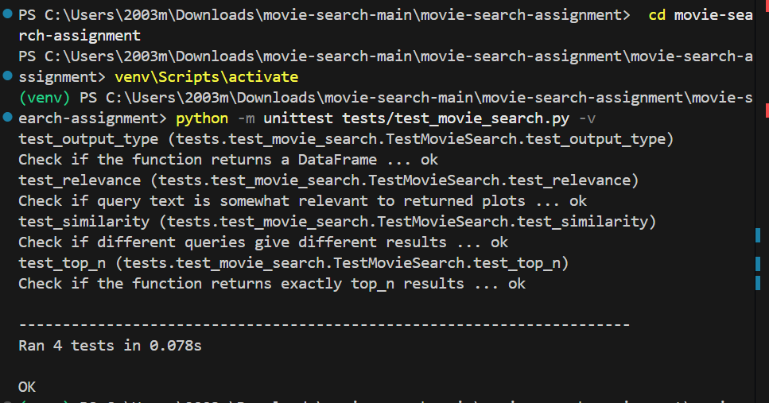

# Movie Semantic Search Assignment
This repository contains my solution for the Semantic Search on Movie Plots Assignment.
The system uses Sentence Transformers
 (all-MiniLM-L6-v2) to embed movie plots and enables semantic search using cosine similarity.

# Student Information
## Name - Manu Sai
## Rollno - 221000032
## Branch - CSE

## Example Search Result



## Setup
Clone the repository and install dependencies:
```bash
git clone https://github.com/your-username/movie-search-assignment.git
cd movie-search-assignment

# Create and activate a virtual environment
python -m venv venv
venv\Scripts\activate      # On Windows
source venv/bin/activate   # On macOS/Linux

# Install dependencies
pip install -r requirements.txt


```
## Running the notebook
Launch Jupyter and open the solution notebook:
```bash
jupyter notebook
```
Open movie_search_solution.ipynb to view the solution.

## Testing
Unit tests are included under tests/test_movie_search.py. Run them with:
```bash
python -m unittest tests/test_movie_search.py -v
```
## Usage
```bash
from movie_search import search_movies

results = search_movies("spy thriller in Paris", top_n=5)
print(results)
```

## Repository Structure
### movie-search-assignment/
### ├── movie_search_solution.ipynb   # Main notebook
### ├── movie_search.py               # Core search module
### ├── movies.csv                    # Dataset
### ├── requirements.txt              # Dependencies
### ├── tests/
### │   └── test_movie_search.py       # Unit tests
### ├── img/
### │   └── res.png                    # Example result screenshot
### └── README.md                     # Documentation


